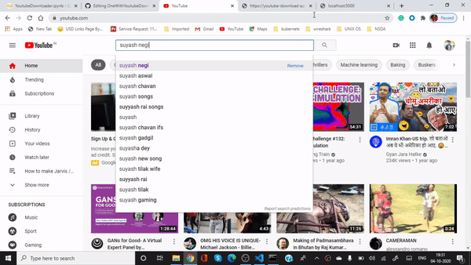
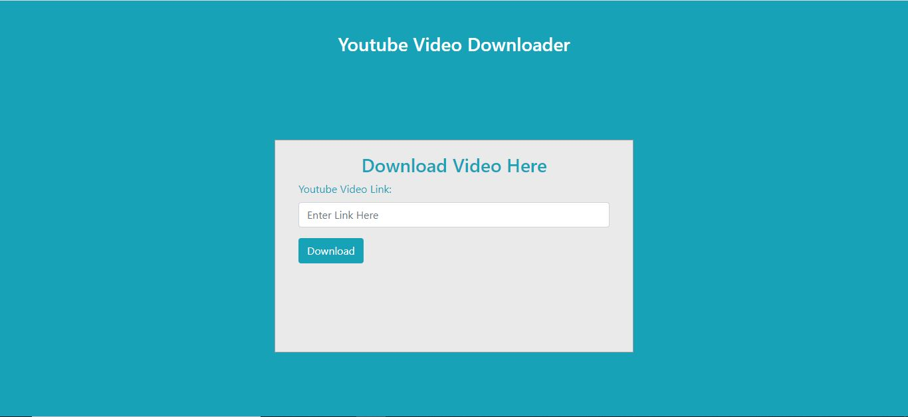

# OneWithYoutubeDownloader
This is a python based flask application making use of PyTube3 library for streaming, storing and downloading youtube videos. 

This Website is hosted at https://youtube-download-application.herokuapp.com/

## DEMO FOR USAGE

  

## Home Screen ScreenShot

  

## Checkout Logic/Code Quickly on Google Colab

To run this on google colab, please follow this <a href="https://gist.github.com/negisuyash/7e9e2b7f9be37a56ab3f4fc8f9919fe1">link</a>.
After this follow the ngrok link to see the output.

## Limitations

As the hosted website is on freemium VM provided by Heroku, So it leads to certain issues such as computation limit for long videos or website may be taken down after 500 hours of computation which comes under free model.

## Want to learn more about PyTube

check out this <a href="https://pypi.org/project/pytube/">link</a>  

